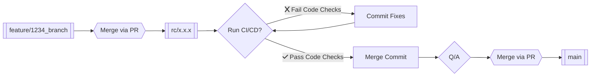

## What Type of Change is This?
- [ ] 🐛 Bug fix
- [ ] ✨ Introduced New Features
- [ ] 🔌 Plugin Updates
- [ ] 🚑 Critical Hotfix
- [ ] 🤕 Patch Fix
- [ ] 🔒️ Security
- [ ] 👷 Deploy/Build System
- [ ] 🔊 Add Logging
- [ ] 🧟‍♂️ Remove Dead Code

---

## 🔎 Overview 
* **What is the current behavior?** (You can also link to an open issue here)

* **What is the new behavior (if this is a feature change)?**

* **Teamwork Task Link:** [Task Name Here](https://builtmighty.teamwork.com)

>> ### 📸 Screenshots (if appropriate):
>> 

---

## 👷 Deployment Notes/Testing Steps
- [ ] Step 1 - 
- [ ] Step 2 -
- [ ] Step 3 - 

---

### 📖 Git Flow Reference

