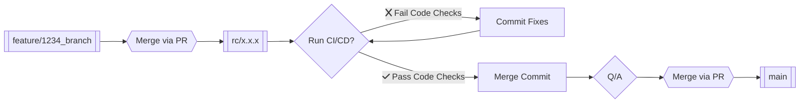

> [!TIP]
>  
> **Copilot Code Review**
> Copilot will automatically review your code if you're merging a branch into the `rc/`. Please let it finish before merging. You can view more documentation [📓 here 📓](https://builtmighty.atlassian.net/wiki/spaces/BMH/pages/755793924/Copilot+Code+Review).

## What Type of Change is This?
- [ ] 🐛 Bug fix
- [ ] ✨ Introduced New Features
- [ ] 🔌 Plugin Updates
- [ ] 🚑 Critical Hotfix
- [ ] ♻️ Change or Refactor to Existing Feature
- [ ] 🤕 Patch Fix
- [ ] 🔒️ Security Updates
- [ ] 👷 Deploy/Build System
- [ ] 🔊 Add Logging
- [ ] 🧟‍♂️ Remove Dead Code
- [ ] 📸 Capturing Uncommitted Code 

---

## 🔎 Overview 
### What is the current issue or behavior? _(You can link to an open Jira issue here...)_
* [ISS-00](https://builtmighty.atlassian.net/browse/ISS-00)

### What is the solution or new behavior? _(If this is a a feature change...)_
* Describe, with details, your solution.
  
### 📸 Screenshots _(If Applicable)_
> Pro Tip: You can copy and paste images directly into GitHub's WYSIWYG

---

## 👷 Deployment Notes/Testing Steps
- [ ] Step 1 - 
- [ ] Step 2 -
- [ ] Step 3 - 

---

### 📖 Git Flow Reference

