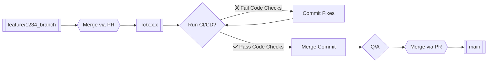

> [!TIP]
>  
> **Claude Commit/Pull Request** 
> If you use the commit command [HERE](https://github.com/builtmighty/.builtmighty-claude), in our Claude plugin, then Claude can generate and fill out this pull request for you.

## What Type of Change is This?
- [ ] 🐛 Bug fix
- [ ] ✨ Introduced New Features
- [ ] 🔌 Plugin Updates
- [ ] 🚑 Critical Hotfix
- [ ] ♻️ Change or Refactor to Existing Feature
- [ ] 🤕 Patch Fix
- [ ] 🔒️ Security Updates
- [ ] 👷 Deploy/Build System
- [ ] 🔊 Add Logging
- [ ] 🧟‍♂️ Remove Dead Code
- [ ] 📸 Capturing Uncommitted Code 

---

## 🔎 Overview 
### What is the current issue or behavior? _(You can link to an open Jira issue here...)_
* [ISS-00](https://crm.builtmighty.com/work/issues/ISS-00)

### What is the solution or new behavior? _(If this is a a feature change...)_
* Describe, with details, your solution.
  
### 📸 Screenshots _(If Applicable)_
> Pro Tip: You can copy and paste images directly into GitHub's WYSIWYG

---

## 👷 Deployment Notes/Testing Steps
- [ ] Step 1 - 
- [ ] Step 2 -
- [ ] Step 3 - 

---

### 📖 Git Flow Reference

```mermaid
flowchart LR
    A[[feature/1234_branch]] --> B{{Merge via PR}}
    B --> C[[rc/x.x.x]]
    C --> D{Run CI/CD?}
    D -->|fa:fa-x Fail Code Checks| E[Commit Fixes] --> D
    D -->|fa:fa-check Pass Code Checks| F[Merge Commit]
    F --> G{ Q/A }
    G --> H{{Merge via PR}}
    H --> I[[main]]
```

